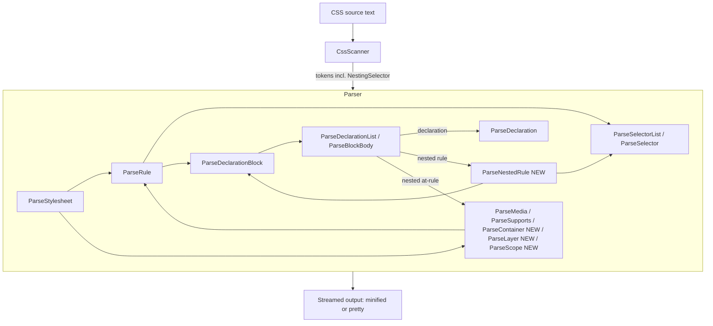
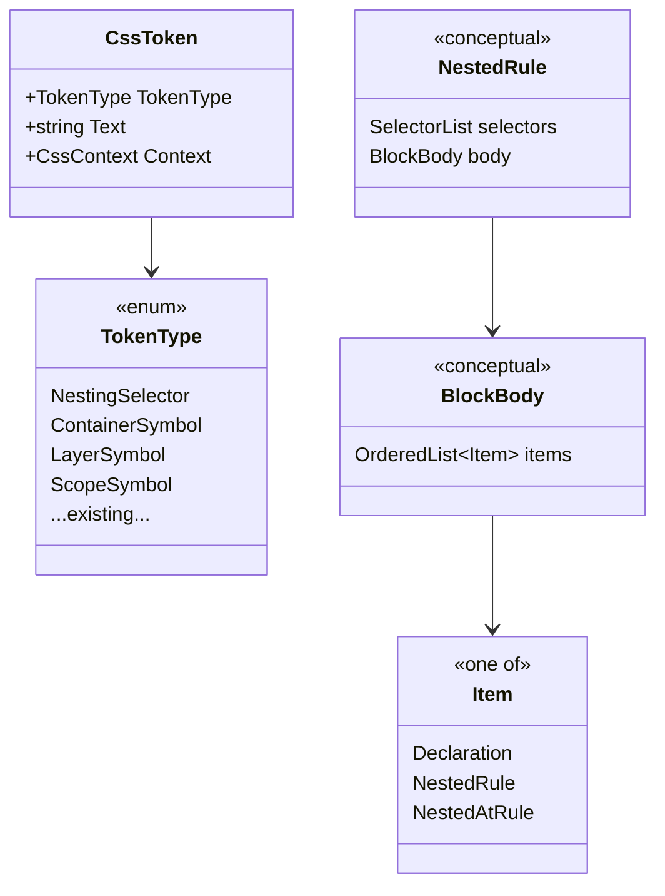

# Design Document

## Overview

This design adds support for [CSS Nesting Module Level 1](https://www.w3.org/TR/css-nesting-1/) to NUglify's CSS pipeline. The work touches two components:

- **`CssScanner`** — must recognize the `&` nesting selector and emit it as a distinct token instead of falling through to a generic `Character` token.
- **`CssParser`** — must recognize style rules nested inside a declaration block, mixing declarations and nested rules in source order, support `&` in all valid selector positions including top-level selector contexts, relative nested selectors (implied leading `&`), nested selector lists, arbitrary depth, and nesting inside `@media`, `@supports`, `@container`, `@layer`, and `@scope`.

The guiding constraint (Requirement 9) is that **non-nested input must be byte-for-byte identical** to today's output in both minified and pretty modes, and must produce the same error set. This heavily shapes the design: nesting support is added as *additional branches* on top of the existing recursive-descent parser and streaming output model, rather than a rewrite. The parser continues to emit output by streaming tokens into a stack of `StringBuilder` "waypoints" as it recognizes constructs; nested rules reuse the exact same emission helpers (`ParseSelector`, `ParseDeclarationBlock`, `NewLine`, `Indent`, `Append`) that non-nested rules use.

### Research summary

Key findings from reading the existing implementation that inform this design:

1. **Streaming, not AST-based.** `CssParser` does not build a syntax tree. It scans tokens and appends formatted text to `m_builders` (a `Stack<StringBuilder>`). "Waypoints" (`PushWaypoint`/`PopWaypoint`) let the parser buffer a construct's output and discard it if it turns out to be empty (this is how `RemoveEmptyBlocks` works). Nesting must be implemented in the same streaming style so ordering and formatting are preserved automatically.

2. **`&` currently degrades to a `Character` token.** In `CssScanner.NextToken`, `&` is not in the `switch`, so it hits `default: ScanIdent()`. `GetIdent()` returns null for `&`, so `ScanIdent` emits `new CssToken(TokenType.Character, '&', ...)`. Two `&` characters already produce two separate `Character` tokens. We will add an explicit scan branch so `&` becomes `TokenType.NestingSelector`, satisfying Requirement 1 and giving the parser a clean signal.

3. **Declaration blocks are declaration-only today.** `ParseDeclarationBlock` opens the brace then calls `ParseDeclarationList`, which loops calling `ParseDeclaration` (expects `identifier : value`) followed by a `;` or `}`. There is no branch for a nested rule. The core parser change is teaching `ParseDeclarationList` to decide, per item, between a declaration and a nested rule.

4. **Rules and selectors already exist and are reusable.** `ParseRule` → `ParseSelector`/`ParseSelectorList` → `ParseSimpleSelector` → `ParseElementName`/`ParseClass`/`ParseAttrib`/`ParsePseudo`, plus `ParseCombinator`. A nested rule is structurally a selector list followed by a declaration block, so we can largely reuse `ParseDeclarationBlock` and the selector machinery, adding only `&` handling and relative-selector handling.

5. **At-rule blocks each have their own rule loop.** `ParseMedia` and `ParseSupports` contain their own `while (ParseRule() || ParseMedia() || ...)` loops for their block bodies. `@container`, `@layer`, and `@scope` need the same treatment so nested rules and direct declarations inside those bodies are handled consistently.

6. **Error handling is via `ReportError` + skip/recover helpers** (`SkipToEndOfStatement`, `SkipToEndOfDeclaration`, `SkipToClose`) and the `CssErrorCode` enum. New nesting errors reuse existing codes where possible and add a small number of new ones.

7. **Output whitespace is controlled by settings.** `Settings.OutputDeclarationWhitespace` (true in pretty mode), `Settings.OutputMode`, `Indent()`/`Unindent()`/`NewLine()`, and `BlocksStartOnSameLine` collectively determine minified vs pretty formatting. Nested rules will call these same helpers, so pretty-mode indentation "just works" as long as the nested rule is emitted while the indent level is inside the parent block.

## Architecture



The central new decision point is inside the declaration-block body (`ParseDeclarationList`, renamed conceptually to a "block body" loop): for each item it must classify the upcoming tokens as one of:

- a **declaration** (`property : value ;`), handled by the existing `ParseDeclaration`;
- a **nested style rule** (a selector — possibly relative/`&`-prefixed — followed by `{`), handled by new `ParseNestedRule`;
- a **nested at-rule** (`@media`/`@supports`/`@container`/`@layer`/`@scope` followed by its prelude and `{`), handled by the at-rule parsers.

### Classification strategy (declaration vs nested rule)

Because the parser is single-pass and streaming, it cannot freely backtrack after emitting output. We use **bounded lookahead into a buffered waypoint**, mirroring the existing `PushWaypoint`/`PopWaypoint` + `NextSignificantToken` patterns already used for semicolon elision:

1. Peek at the first non-space token of the item.
2. If it is `NestingSelector` (`&`), or a `Combinator` character (`>`, `+`, `~`), the item is unambiguously a nested rule (declarations never start with these). Route to `ParseNestedRule`.
3. If it is one of the recognized at-rule symbols (`MediaSymbol`, `Supports`, `ContainerSymbol`, `LayerSymbol`, `ScopeSymbol`), route to the corresponding at-rule parser (nested at-rule).
4. If it is an `Identifier`, the item is ambiguous (`color: red;` vs `color { ... }` — the latter being a nested type-selector rule). Parse into a buffered waypoint far enough to find the disambiguating token:
   - a `:` that is part of a declaration's `property:value` (not a pseudo-class `:` — pseudo only appears after a selector, and a leading identifier followed immediately by `:` at block-body position is a property) → **declaration**;
   - a `{` (after a compound/complex selector) → **nested rule**;
   - a `;` or `}` before either → **declaration** (existing behavior, e.g. custom-property valueless decl).
   Emit the buffered text into the chosen sub-parser's stream so no output is lost or reordered.
5. Any other leading token that begins a valid compound selector (`.`, `#`, `[`, `:`, `*`) with no property-name interpretation is a relative nested rule → `ParseNestedRule` (Requirement 4.2).

To keep Requirement 9 (byte-for-byte non-nested output) safe, the ambiguous-identifier path is written so that when the item resolves to a **declaration**, the tokens are handed to the *unmodified* `ParseDeclaration` logic and produce identical output to today. The lookahead only changes behavior when a `{` (nested rule) is discovered. The normal selector parser is also extended to accept `TokenType.NestingSelector` in non-nested selector contexts so top-level selectors such as `&`, `&:hover`, and `:is(&,.foo)` are preserved verbatim instead of being rewritten.

### Preserving source order

Requirement 2.2/2.3/8.6 require declarations and nested rules to be emitted in source order with no reordering. Because the block-body loop emits each item to the current builder as soon as it is recognized, and processes items strictly left-to-right, **source order is preserved by construction**. The parser never collects declarations into one bucket and rules into another; it streams them interleaved. This means Requirement 2.4 (fail rather than reorder) is satisfied trivially — there is no code path that reorders, so the "cannot preserve order" branch is unreachable and reduces to the general parse-error path.

## Components and Interfaces

### CssScanner changes

**New token type.** Add `NestingSelector` to the `TokenType` enum (`CssToken.cs`).

**New scan branch.** In `CssScanner.NextToken`, add a case for `&`:

```csharp
case '&':
    NextChar();
    token = new CssToken(TokenType.NestingSelector, "&", m_context);
    break;
```

Behavior notes mapped to Requirement 1:
- One `&` → one `NestingSelector` token (1.1).
- `&&` → the scanner reads one `&`, emits a token, and on the next call reads the second `&` and emits a second token → exactly two adjacent tokens (1.2).
- `&.bar` / `.parent&` → `&` is a self-contained single-character token; adjacency (no whitespace) is naturally preserved because the scanner only emits a `Space` token when whitespace is actually present (1.3).
- `&` inside strings/comments is never reached because `ScanString`/`ScanComment` consume those contexts before the `&` case is evaluated (1.4).
- The scanner emits the token unconditionally; **position validity** (e.g. `&` inside a declaration value) is enforced by the parser, which reports an error identifying the token position (1.5). The scanner change is context-free, which keeps it simple and preserves existing scanning for all non-`&` input (Requirement 9).

### CssParser changes

**New method `ParseNestedRule`.** Structurally parallels `ParseRule` but is called from within a declaration-block body and understands `&`/relative selectors:

```csharp
Parsed ParseNestedRule()
```
- Pushes a waypoint (so `RemoveEmptyBlocks` can drop an empty nested rule — Requirement 8.4).
- Parses a nested selector list via `ParseNestedSelectorList`.
- On `{`, calls the existing `ParseDeclarationBlock(false)` — which recurses back into the block-body loop, giving arbitrary-depth nesting for free (Requirement 6.2/6.3).
- Emits with `NewLine`/`Indent` exactly as `ParseRule` does, so pretty-mode indentation nests one level per depth (Requirement 8.7).

**New methods `ParseNestedSelectorList` / `ParseNestedSelector`.** Wrap the existing selector machinery, adding two behaviors:
- **`&` handling:** when the current token is `NestingSelector`, append `&` and continue the compound/complex selector using existing `ParseSimpleSelector`/`ParseCombinator`. `&` may appear standalone (3.1), joined (`&.bar`, `&:hover`) with zero added whitespace (3.2), multiple times (`& + &`) preserving combinators (3.3), after another selector (`.parent &`) (3.4), and doubled (`&&`) with zero whitespace (3.5).
- **Relative selectors:** if a nested selector begins with a combinator (`>`, `+`, `~`) or a bare compound selector, it is accepted as-is with an *implied* leading `&`. The parser does **not** insert an explicit `&` into the output (Requirement 4.3/4.4) — it emits exactly what was written.
- **Selector-list pseudo functions:** while parsing a nested selector, pseudo functions whose arguments are selector lists (`:is`, `:where`, `:not`, and existing selector-list pseudos) recurse back into `ParseNestedSelectorList` so `&` remains valid inside those argument lists.

**Modify the block-body loop** (currently `ParseDeclarationList`). Introduce the classification described in the Architecture section. Rename the shared body loop or add an internal helper (e.g. `ParseBlockBody`) that `ParseDeclarationBlock` calls; when `CssType.DeclarationList` is used at the top level, the same loop applies so top-level declaration lists can also contain nested rules if a selector appears. The existing declaration-only fast path is retained for byte-for-byte fidelity.

**At-rule support inside blocks.** The block-body loop also recognizes nested at-rules (`@media`, `@supports`, `@container`, `@layer`, `@scope`) and routes them to their parsers (Requirement 7.3). `ParseMedia`/`ParseSupports` already contain rule loops; those loops, along with the new shared grouping-body path used by `@container`, `@layer`, and `@scope`, recurse into nested rules and preserve direct declarations in source order (Requirement 7.1).

**New methods `ParseContainer`, `ParseLayer`, and `ParseScope`.** Add:
- Scanner: recognize `CONTAINER`, `LAYER`, and `SCOPE` in `ScanAtKeyword`, adding `ContainerSymbol`, `LayerSymbol`, and `ScopeSymbol` token types.
- Parser: `ParseContainer` preserves the prelude text with minified spacing and then runs the shared grouping-at-rule body loop for the block form. `ParseLayer` and `ParseScope` do the same, with `ParseScope` additionally allowing nested-selector parsing inside its prelude so forms such as `@scope (&)` and `@scope (& > .scope) to (& .limit)` are retained. These are added to the stylesheet-level and block-level dispatch chains.

> Note: adding real `@container`/`@layer`/`@scope` parsing changes behavior for input that previously fell through to the generic `AtKeyword` skip path. This is new functionality, so Requirement 9's guarantee remains scoped to inputs that do not rely on these new nesting-aware branches.

### Interface summary

| Method | Status | Responsibility |
|---|---|---|
| `CssScanner.NextToken` | modified | Emit `NestingSelector` for `&`; recognize `@container`/`@layer`/`@scope` |
| `ParseBlockBody` (was `ParseDeclarationList`) | modified | Per-item classify: declaration / nested rule / nested at-rule |
| `ParseNestedRule` | new | Parse a nested style rule inside a block |
| `ParseNestedSelectorList` / `ParseNestedSelector` | new | Parse `&`, relative, and list selectors |
| `ParseDeclaration` | unchanged | Declarations (fidelity path) |
| `ParseDeclarationBlock` | reused | Braces + recursion into block body |
| `ParseContainer` / `ParseLayer` / `ParseScope` | new | At-rule prelude + block body loop |
| `ParseMedia` / `ParseSupports` | minor | Already loop over `ParseRule`; benefit from nested `&` |

## Data Models

The parser is streaming and holds no persistent AST, so the "data model" is the transient parsing state plus the token stream. The relevant conceptual model:



- **Token stream:** the only concrete new data is the `NestingSelector`, `LayerSymbol`, and `ScopeSymbol` token types. Everything else is existing token types (`Character` for `>`/`+`/`~`/`,`/`{`/`}`, `Identifier`, `Hash`, etc.).
- **Nesting depth:** tracked implicitly by recursion depth of `ParseDeclarationBlock` ⇄ `ParseNestedRule` and by `indentLevel` for pretty output. No fixed cap is imposed (Requirement 6.3); depth is bounded only by the runtime call stack / available memory.
- **Output builders:** the existing `Stack<StringBuilder>` waypoint model; each nested rule pushes/pops one waypoint for empty-block removal.

## Correctness Properties

*A property is a characteristic or behavior that should hold true across all valid executions of a system — essentially, a formal statement about what the system should do. Properties serve as the bridge between human-readable specifications and machine-verifiable correctness guarantees.*

CSS minification is a text-to-text transformation over a large, structured input space (arbitrary nested stylesheets), which is an excellent fit for property-based testing: we can generate random valid nested CSS and assert structural invariants, idempotence, and round-trip behavior across hundreds of inputs. The following properties were derived from the prework analysis of the acceptance criteria.

### Property 1: Nesting selector token count

*For any* selector-context string containing N unescaped `&` characters (none inside strings or comments), the scanner produces exactly N `NestingSelector` tokens, one per `&`, none merged.

**Validates: Requirements 1.1, 1.2, 1.3**

### Property 2: Ampersand in a literal is never a nesting token

*For any* CSS input where every `&` occurs inside a string literal or a comment, the scanner produces zero `NestingSelector` tokens.

**Validates: Requirements 1.4**

### Property 3: Source order preservation

*For any* declaration block containing an arbitrary interleaving of declarations and nested rules, the relative order of those items in the minified and pretty output matches their order in the source.

**Validates: Requirements 2.2, 2.3, 8.6**

### Property 4: Nesting structure round-trip

*For any* valid nested stylesheet, parsing the source and then re-parsing the parser's own output yields output identical to the first pass (the transformation is idempotent and preserves the parent/child nesting association and depth).

**Validates: Requirements 2.1, 6.4, 7.4**

### Property 5: Nesting selector emitted verbatim in position

*For any* nested selector using `&` standalone, joined to a compound selector, doubled (`&&`), repeated with combinators (`& + &`), or placed after another selector (`.parent &`), the output preserves every `&` occurrence in source order with the same combinators and with zero whitespace where the source had none.

**Validates: Requirements 3.1, 3.2, 3.3, 3.4, 3.5**

### Property 6: Relative nested selectors keep their leading form

*For any* nested selector that begins with a combinator (`>`, `+`, `~`) or a bare compound selector, the output preserves the leading combinator or compound selector unchanged and never inserts an explicit `&`.

**Validates: Requirements 4.1, 4.2, 4.3, 4.4**

### Property 7: Nested selector list membership

*For any* nested selector list of two or more selectors sharing one block, every source selector appears in the output list in source order, separated by a single comma with no surrounding whitespace in minified output.

**Validates: Requirements 5.1, 5.2, 5.4, 8.2**

### Property 8: Invalid nested selector list fails atomically

*For any* nested selector list containing an empty selector position (leading, trailing, or doubled comma) or an invalid selector, the parser reports a parse error and emits none of the list's selectors rather than partial output.

**Validates: Requirements 5.5, 5.6**

### Property 9: Arbitrary depth is preserved

*For any* nesting depth D (including D ≥ 64), a stylesheet nested to depth D parses without a fixed-depth failure and the emitted output has nesting depth D.

**Validates: Requirements 6.2, 6.3, 6.4**

### Property 10: At-rule containment is preserved

*For any* nested rules contained within an `@media`, `@supports`, `@container`, `@layer`, or `@scope` block, the output keeps those nested rules inside the braces of that at-rule block in both minified and pretty output, preserving direct declarations in those bodies in source order.

**Validates: Requirements 7.1, 7.2, 7.3, 7.4, 7.5, 7.6, 7.7**

### Property 11: Minified output whitespace invariants

*For any* parent rule containing nested rules, minified output contains no whitespace immediately inside or outside braces, none around the declaration colon or selector-list commas, no whitespace around `>`/`+`/`~` combinators, and exactly one space for the descendant combinator; a declaration following a nested rule's closing brace has no separator inserted.

**Validates: Requirements 8.1, 8.2, 8.3, 8.6**

### Property 12: Empty-block removal

*For any* stylesheet, when `RemoveEmptyBlocks` is enabled, any nested rule whose block becomes empty is omitted, and any parent rule left with an empty block after such removal is itself omitted.

**Validates: Requirements 8.4, 8.5**

### Property 13: Non-nested output is unchanged

*For any* CSS input containing no `&` and no nested rules, the output under given `CssSettings` is byte-for-byte identical to the output of the pre-nesting parser for the same input and settings, in both minified and pretty modes, and the same set of parse errors is reported.

**Validates: Requirements 9.1, 9.2, 9.3**

## Error Handling

Error handling reuses the existing `ReportError` + skip/recover machinery. Errors are reported with the offending token's `CssContext` (line/column), matching existing behavior.

| Condition | Requirement | Handling |
|---|---|---|
| `&` in an invalid position (e.g. inside a declaration value) | 1.5, 3.8 | `ParseDeclaration`/`ParseExpr` encounters `NestingSelector` where a term is expected → `ReportError(0, ...)` identifying the token, then `SkipToEndOfDeclaration`. A new `CssErrorCode.UnexpectedNestingSelector` is added. |
| Block-body item matches neither declaration nor nested rule | 2.5 | `ReportError` with token position; reject the enclosing rule (discard its waypoint) rather than emit partial output. Reuses `ExpectedSelector`/`UnexpectedToken`. |
| Unterminated nested block at EOF | 2.6, 6.5, 7.6 | Existing `ParseDeclarationBlock` EOF branch reports `CssErrorCode.UnexpectedEndOfFile` with the block's start position. |
| Leading combinator not followed by a valid compound selector | 4.5 | `ParseNestedSelector` reports `ExpectedSelector` at the offending token and fails the rule. |
| Empty selector position / invalid selector in nested list | 5.5, 5.6 | `ParseNestedSelectorList` fails the entire list (discards buffered output for the list) and reports `ExpectedSelector`; no selectors emitted. |
| Malformed / EOF inside at-rule block containing nested rules | 7.6 | At-rule parsers report `ExpectedClosingBrace`/`UnexpectedEndOfFile` as they do today. |

New error codes added to `CssErrorCode`:
- `UnexpectedNestingSelector` — `&` used where a selector is not permitted.

Atomicity requirement (2.5, 5.5, 6.5): the waypoint mechanism (`PushWaypoint`/`PopWaypoint(keepText: false)`) is used to discard a failed rule's partial output so the parser never emits a partially-formed or flattened rule.

## Testing Strategy

### Property-based tests

PBT is appropriate here because the parser/minifier is a deterministic text transformation with a large structured input space and clear universal invariants (round-trip, idempotence, structural preservation, whitespace invariants).

- **Library:** [FsCheck](https://fscheck.github.io/FsCheck/) (the established .NET property-based testing library; works with NUnit, which NUglify already uses). Do not hand-roll a generator framework.
- **Generators:** a `Gen<string>` that produces random valid nested CSS — random compound/complex selectors, random `&` placements (standalone, joined, doubled, repeated, trailing), random relative selectors, random interleavings of declarations and nested rules, random nesting depth (including ≥ 64), and random wrapping in `@media`/`@supports`/`@layer`/`@scope`. Edge cases (empty content, non-ASCII identifiers, whitespace variance, comments containing `&`) are baked into the generators.
- **Configuration:** minimum **100 iterations** per property.
- **Tagging:** each property test is tagged with a comment `// Feature: css-nesting, Property {number}: {property_text}` referencing the property above, and implemented as a **single** property test per property.
- Properties 1–2 test the scanner directly; 3–12 test parser output; 13 is the regression guard.

Property 13 is implemented by generating random *non-nested* CSS and asserting the current output equals a captured baseline / equals the output computed with the nesting code paths disabled, in both minified and pretty modes.

### Example-based unit tests

Concrete tests in `src/NUglify.Tests/Css/Nesting.cs` covering the specification's canonical examples, following the existing test conventions in the `Css` test folder (input string → expected minified/pretty output):

- Standalone `&`, `&.bar`, `& + &`, `.parent &`, `&&`.
- Top-level selector-context `&` cases such as `&`, `&:hover`, and `:is(&,.foo)`.
- Relative selectors: `> .baz`, `+ .bar`, `~ .qux`, and bare `.child { ... }`.
- Nested selector lists: `&:hover, &:focus { ... }`, plus `&` inside `:is(...)`, `:where(...)`, and `:not(...)`.
- Mixed declarations and nested rules in source order, and a declaration immediately after a nested rule's closing brace.
- Deep nesting (a few explicit levels) and a generated 64+-level case.
- Nesting inside `@media`, `@supports`, `@container`, `@layer`, `@scope`, including direct declarations in nested group-rule bodies and `&` in nested `@scope` preludes.
- Pretty-mode indentation of nested rules.
- `RemoveEmptyBlocks` dropping empty nested rules and empty parents.

### Error-case tests

Example-based tests asserting a parse error (and no partial output) for: `&` inside a declaration value; leading/trailing/double comma in a nested list; leading combinator with no following selector; unterminated nested block at EOF.

### Regression tests

Run the full existing `NUglify.Tests` CSS suite unchanged to confirm Requirement 9. Any pre-existing `@layer`/`@scope` pass-through tests are reviewed and updated to reflect the new real parsing.
